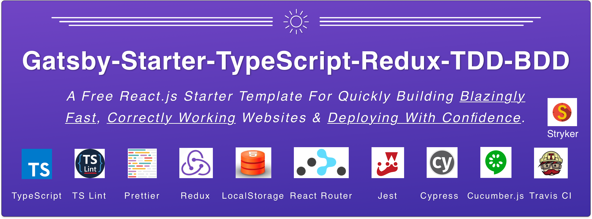

An awesome Gatsby starter template project that takes care of the tooling setup, allowing you and your team to dive right into building ultra-fast React applications with test-driven development!

[](https://travis-ci.org/JimTheMan/Gatsby-Starter-TypeScript-Redux-TDD-BDD)

# Features

 - [x] TypeScript pre-installed and all src files have been converted to TypeScript.
 - [x] Redux preinstalled and with simple examples of actions, reducers, and types, and custom middlewares. 
 - [x] Redux-devtools support preinstalled (For usage with Redux Dev Tools Chrome Extension)
 - [x] Redux-localstorage-simple preinstalled (For automatic syncing of specified reducers to local storage)
 - [x] Unit testing with Jest pre-configured and ready to go. 
 - [x] End-to-end UI automation testing with Cypress pre-configured. 
 - [x] Cucumber plugin preinstalled into Cypress to run gherkin features files and steps definitions for outside-in behavior-driven-development. 
 - [x] Linting pre-configured with Prettier and TSLint.
 - [x] Continuous integration & continuous deploy setup with Travis CI.


# Usage
You can scaffold out a fresh new gatsby project use this template with the gatsby `new` command.

This will create, in the current directory, a new folder named `my-cool-react-project` containing a fresh scaffold of this starter.
```
gatsby new my-cool-react-project https://github.com/JimTheMan/Gatsby-Starter-TypeScript-Redux-TDD-BDD
```

Then navigate into your snazzy new project, and you're ready to go!
```
cd my-cool-react-project
```

_note: installing gatsby globally, `npm i -g gatsby`, will probably make development easier, but you could also use `npx gatsby` if you didn't want to._


This project uses relatively new libraries so any node version below v11 will probably just result in build issues. We recommend v11.15.0, and if you have [nvm](https://github.com/nvm-sh/nvm) installed you can switch to this version like so:
```
nvm use
```

Install dependencies:
```
npm i
```

Run locally (with hot module reloading)
```
npm run deploy
```

Create local build
```
npm run build
```

Serve local build
```
npm run serve
```

Run Unit Tests (TDD watch-mode style)
```
npm test
```

Run Unit Tests (Single run for CI and with code coverage output)
```
npm run test-once
```

Run BDD / E2e Tests (Locally With UI)
```
npm run e2e
```

Run BDD / E2e Tests (Headless Mode for CI):
```
node_modules/.bin/cypress run
```

Run linting
```
npm run lint
```

Deploy
```
npx gatsby deploy
```


## Developing With A Test-First Mindset
This is, after all, the "TDD-BDD" template, and it was designed to be used by engineering teams following these test-driven and behavior-driven methodologies. This project is set up excellently for following an "outside-in" testing strategy. At a high level, this how our feature development process normally goes:

### 1. Create a Feature File With User Stories For The New Feature
Starting with the feature files ensures that you are only building things that truly provide user-facing value. In the "Scenario" block you explicitly write what the user wants to be able to do any why. We recommend always that in general when writing these user story scenarios you follow the "As a... / I want to... / Because..." structure. 

### 2. Describe the Scenarios In More Detail With Given, When, Then Syntax
Now that you have user stories, we can write these as tests that we can execute. We describe what happens in our systems as the hypothetical user interacts with it in order to map the user flows easily to step definitions and UI automation tests. In the "Given" section you write the setup code. In the "When" section you write the actual action you are testing, and in the "Then" section we write our assertions. You may also use the Gherkin keywords "And" and "But" if you believe they will make your tests more consolidated.

### 3. Write Failing Step Definitions
Even without writing any src code for the feature, you might be surprised how much of it you can imagine and write tests for beforehand. You can at least create some empty step definitions mapping to each Feature file, and often the "Given" step's Gherkin is something like, "Given I'm X user on the Z page", and you can easily see the two-liner implementation for that in the code here. The "When" is the action you are trying to test. For example, "When I click this button" or, "when I interact with the app in some way" are good choices, and to implement this you basically follow the very good Cypress api for selecting the proper elements and interacting with them. Sometimes you will need to use ".then" and drop into JQuery element world (which we provide examples of here), but in the end, you can do whatever you could want to do without worry that broken tests are the library's fault. hehe. Then "Then" block should be your expectations which you are performing from a user point of view. Think about how the UI on the page should change after some user performs the "When" step- what in the DOM then will be different? If you can answer that question then you can basically fill your "Then" step definitions with cypress code that latches onto these change DOM elements and asserts they are changing in the expected way!


### 4. Write The Implementation Code With "Classic TDD"
After you write your failing step definitions it can be tempting you just write all the source code and get it working, but don't jump the gun! It's important to see your unit tests failing before you implement the code so that you can be confident you aren't just getting false-positive passing unit tests when writing them after the fact (this can be countered by occasionally purposely changing the source code and correctly guessing how the tests fail as a sanity check, but this is a slippery slope to start playing and in our experiences normally ends in sloppier tests). When we say "Classic TDD" we mean basically writing source code with unit tests in short red-green-refactor cycles. Write some failing bit, make it pass, and then refactor your code (and the beauty is you should instantly know by failing tests if you've accidentally broken the logic with your refactorings). In this project, we have chosen to use Jest for unit testing. This project provides some examples for testing redux-integrated components, shallow-rendering components, etc. We also provide examples for testing asynchronous services and testing all our various redux-related files. When unit testing, keep in mind to "test the edges" of whatever thing you are trying to test. For a pure function, write a test for each different input you can pass into it and assert that the correct output is returned. For components and more complex functions, it can get a bit hairy sometimes, but the idea is that your unit test code should be concerned with the "edges" of your isolated system under test should guide you towards writing good unit tests. 

### 5. Once The Unit Tests Pass, Circle Back To The Step Definitions 
It's a great feeling when you have solid unit test coverage and a working new feature built. Great! At this point, it can be very to tempting to just merge that puppy into your CI deploying branch, but again just hold your horses! If we had written our failing step definitions perfectly previously then they would be passing now that our source code has been written with such bulletproof TDD style as to have considered _all_ the cases, right? hehe.

### 6. Once All the Tests Are Passing, Your System Should Work!
Assuming the external systems your application is interacting with are working properly, environment variables are set correctly, etc. then your feature should be deployed automatically by the continuous integration server automatically (be sure to replace the line in .travis.yml that says, "do your deploy commands here!" with the code for deploying to your hosting provider).

## What To Do If Bugs Are Found!
First of all, don't panic. If someone finds a bug, the first step to describing it to others is to just give steps for recreating the bug. In the end, say what actually happened, and the user should expect to happen. Notice how we said "should expect" there, and indeed it shouldn't be too difficult to turn these _user stories_ describing the correct behavior into one or more Scenarios that would live in a feature file.

## Unit Tests & End-To-End Tests: The Ying & Yang of Automated Testing
It's very important to have BOTH the end-to-end UI tests and the unit tests because they really provide different purposes and really pick up for the weaknesses of the other. A suite of passing end-to-end tests that thoroughly and correctly test your entire system can give you a high level of confidence that that system should be working properly. However, when the cypress tests break they don't always give you a great deal of insight into _why_ the bug is happening and what in the code needs to be changed in order to fix it! Unit tests are in a way the reverse. Since unit tests are very focused and specific, a failure should give you exact line numbers in the code and show exactly the output in the code that was expected vs what was returned. As great essential as unit tests are for deploying with confidence, it seems that we can never _truly_ believe front-end applications are working properly, as a whole and from a user-perspective with just passing unit tests alone.


## Cypress Is Great For UI Testing
There are many UI automation libraries, and while I'm not going to throw out any names of clunky or frustrating to use ones, our team has really found working with Cypress, for the most part (and after some initial growing pains) to be a joy. The excellent auto-rerunning UI development environment, great api that is promise-based but is abstract enough to where things just work properly and consistently. For browser development in particular, we definitely have found Cypress to be excellent! Another thing we like about Cypress is that it is completely agnostic to the front-end framework you use, yet it works with React extremely well!


## A Word On "Chasing Hunnits" Aka What Not To Test
Once you get familiar with unit testing you want to test everything, and sometimes you may feel the need to test everything just for the sake of testing everything. Sure, it's nice to look at fully green unit test code coverage reports (such as the one from Titanium Lambda), but in reality testing unit testing isn't always easy, it takes some time for you to sit down and really think about what's going on and ensure you are testing the right things (which is why having a pair partner there keeping you honest is so great). For example, in this project we chose not to write unit tests for the configuration files from `gatsby-default-starter` such as `seo.tsx` or `404.tsx`. 


## Screenshot Testing
This project does not include any screenshot testing. We believe that once your project is in a really solid state where the UI is pretty set, then some screenshot testing framework such as [percy.io](https://percy.io/) can be extremely useful in ensuring there are no regressions in the CSS, layout, or other visual elements that are not particularly well suited for testing with Cypress. We encourage you to experiment with whatever other types of automated testing you may find useful, but we would advise not to forgo the base unit testing & cypress + cucumber testing we recommend here! 


## Replacing PropTypes with TypeScript Interfaces
We struggled for a while with trying to figure out how to specify through React `propTypes` that some property was an instance of a TypeScript interface. Then after not finding a good solution and speaking to other engineers, we concluded that we preferred to use functional components that use TypeScript to define the types of the props instead of propTypes. This just overall made things easier, and the React propTypes don't really provide any extra information that can't be conveyed arguably more cleanly with interfaces and so we figured keeping the propTypes would only be an unnecessary duplication and burden for reading and updating these props later. 


## Disclaimer
This project comes with the MIT open source license which means go and ahead and use it for your own commercial projects, but we ain't responsible for any possible bugs. ;)


## Contributing To This Project
We love feedback! Feel free to open issues or pull requests if you have any questions, difficulties, or ideas!


## Gatsby Config Files

- **`gatsby-browser.js`**: This file is where Gatsby expects to find any usage of the [Gatsby browser APIs](https://www.gatsbyjs.org/docs/browser-apis/) (if any). These allow customization/extension of default Gatsby settings affecting the browser.

- **`gatsby-config.js`**: This is the main configuration file for a Gatsby site. This is where you can specify information about your site (metadata) like the site title and description, which Gatsby plugins you’d like to include, etc. (Check out the [config docs](https://www.gatsbyjs.org/docs/gatsby-config/) for more detail).

- **`gatsby-node.js`**: This file is where Gatsby expects to find any usage of the [Gatsby Node APIs](https://www.gatsbyjs.org/docs/node-apis/) (if any). These allow customization/extension of default Gatsby settings affecting pieces of the site build process.

- **`gatsby-ssr.js`**: This file is where Gatsby expects to find any usage of the [Gatsby server-side rendering APIs](https://www.gatsbyjs.org/docs/ssr-apis/) (if any). These allow customization of default Gatsby settings affecting server-side rendering.

## Learning More About Gatsby

Looking for more guidance? Full documentation for Gatsby lives [on the website](https://www.gatsbyjs.org/). Here are some places to start:

- **For most developers, we recommend starting with our [in-depth tutorial for creating a site with Gatsby](https://www.gatsbyjs.org/tutorial/).** It starts with zero assumptions about your level of ability and walks through every step of the process.

- **To dive straight into code samples, head [to our documentation](https://www.gatsbyjs.org/docs/).** In particular, check out the _Guides_, _API Reference_, and _Advanced Tutorials_ sections in the sidebar.


# From Scratch Setup Guide
If you are interested in learning how this project was created or would like to be your own modified starter, we have documented our steps as of the creating of this project below.

This project was initially created with the [gatsby-starter-default](https://github.com/gatsbyjs/gatsby-starter-default) project.
```
gatsby new myproject https://github.com/gatsbyjs/gatsby-starter-default
```

## Adding TypeScript From Scratch
Then type
```
npm install gatsby-plugin-typescript
```

Included this in gatsby-config.js:
```
module.exports = {
 // ...,
 plugins: [`gatsby-plugin-typescript`],
}
```

Then we basically just changed all the js files to tsx files and had to install these type defs for React Helmet:
```
npm i @types/react-helmet
```

## Adding BDD Tests From Scratch

First, install cypress and the cypress-cucumber plugin:
```
npm install cypress --save-dev
npm i cypress-cucumber-preprocessor --save-dev
```

Cypress will scaffold out a bunch of files when you run "open" for the first time:
```
node_modules/.bin/cypress open
```


Then replace cypress/plugins/index.js with this:
```
var cucumber = require("cypress-cucumber-preprocessor").default

module.exports = (on, config) => {
 on("file:preprocessor", cucumber())
};
```

- Create a folder named "features" within cypress/integration and place feature files there containing gherkin.

- Create a folder "step_definitions" within cypress/support and place step definition files there. Use /cypress/support/step_definitions/google-hello-world.js as a template.

_Note: For us, it was very important to put the things above in these specific directories since these were the only locations where my files were actually found and run properly by cypress & cucumber._

To run the cucumber specs first open cypress with `npm run cypress:open` and click on the feature files.

To run in headless mode: `npm run cypress:run`

Note, you can also ignore everything but the feature files by adding the option in cypress.json

## Adding Redux
First, install the npm libraries for `gatsby-plugin-react-redux`, `react-redux`, and `redux`:
```
npm install --save gatsby-plugin-react-redux react-redux redux
```

Created a `./src/store/createStore.ts` file containing this:
```
import { createStore } from 'redux';

function reducer() {
 //...
}

// preloadedState will be passed in by the plugin
export default preloadedState => {
 return createStore(reducer, preloadedState);
};
```

And added this plugin to the list in `./gatsby-config.js`:
```
module.exports = {
 plugins: [
 {
 resolve: `gatsby-plugin-react-redux`,
 options: {
 // [required] - path to your createStore module
 pathToCreateStoreModule: './src/state/createStore',
 // [optional] - options passed to `serialize-javascript`
 // info: https://github.com/yahoo/serialize-javascript#options
 // will be merged with these defaults:
 serialize: {
 space: 0,
 isJSON: true,
 unsafe: false,
 },
 },
 },
 ],
};
```

## Redux Dev Tools Setup
First, install:
```
npm install --save redux-devtools-extension
```

and use `composeWithDevTools` when creating your store:
```
import { createStore, applyMiddleware } from 'redux';
import { composeWithDevTools } from 'redux-devtools-extension';

const store = createStore(reducer, composeWithDevTools(
 applyMiddleware(...middleware),
 // other store enhancers if any
));
```

## Redux Local Storage Setup
First, install:
```
npm i --save-dev redux-localstorage-simple
```

Then change your createStore function to use _both_ gatsby's preloaded state and the slices of state you'd like to be automatically synced with localstorage:
```
export default preloadedState => {
 return createStore(
 combinedReducers,
 getLoadedState(preloadedState),
 composeWithDevTools(
 applyMiddleware(
 save({ states: ['loginReducer'] }),
 someCustomMiddleware(),
 )
 ),

 );
};

const getLoadedState = (preloadedState) => {
 if (typeof window !== 'undefined')
 return {
 ...preloadedState,
 ...load({ states: ['loginReducer'], disableWarnings: true }),
 }
 return {
 ...preloadedState,
 }
}
```


## Custom Middleware Setup
After developing React applications for a while, most engineers will agree that the code for asynchronous calls should not live inside of any individual component. A "middleware" is a great place to put asynchronous code because it sits right in between the components and the redux state. In a nutshell, the way it works is that components (or other redux-connected services) dispatch an action for triggering the action call, which is handled by the middleware, and when the middleware's async operation finishes a corresponding success or failure Redux action is then dispatched with the payload. This project provides an example of a custom middleware and unit tests so that you can hit the ground running with clean management of asynchronous operations in your projects.

Custom middlewares can be added to a project relatively easily by adding it as an argument of "applyMiddleware" in your `createStore` function. Here's an example of how we can add "todosCustomMiddleware" and "loginCustomMiddleware" so that they can intercept and dispatch Redux actions to your application's Redux store.

```
 return createStore(
 combinedReducers,
 getLoadedState(preloadedState),
 composeWithDevTools(
 applyMiddleware(
 save({ states: ['loginReducer'] }),
 todosCustomMiddleware(),
 loginCustomMiddleware()
 )
 ),

 );
```


## Jest Configuration
Configuring jest correctly with typescript was a bit of a struggle. One gotcha for us was that using the package.json "jest" option caused unexpected issues... Instead, we set the configuration via a `jest.config.js` file:

```
module.exports = {

 transform: {
 "^.+\\.[jt]sx?$": "<rootDir>/jest-preprocess.js",
 },
 moduleNameMapper: {
 ".+\\.(css|styl|less|sass|scss)$": `identity-obj-proxy`,
 ".+\\.(jpg|jpeg|png|gif|eot|otf|webp|svg|ttf|woff|woff2|mp4|webm|wav|mp3|m4a|aac|oga)$": `<rootDir>/__mocks__/file-mock.js`,
 },
 testPathIgnorePatterns: [`node_modules`, `.cache`, `public`],
 transformIgnorePatterns: [`node_modules/(?!(gatsby)/)`],
 globals: {
 __PATH_PREFIX__: ``,
 },
 testURL: `http://localhost`,
 setupFiles: [`<rootDir>/loadershim.js`],
 collectCoverageFrom: [
 "**/*.{ts,tsx}",
 "!**/node_modules/**"
 ],
 collectCoverage: true,
 coverageDirectory: 'coverage',
 preset: "ts-jest",
 moduleFileExtensions: [
 "js",
 "jsx",
 "ts",
 "tsx"
 ]
}
```

and a `jest.preprocess.js` file:
```
const babelOptions = {
 presets: ["babel-preset-gatsby", "@babel/preset-typescript"],
}

module.exports = require("babel-jest").createTransformer(babelOptions)
```

## Adding Travis CI
Now that you have all of these automated tests checking that the application id working properly, wouldn't it be awesome if when you pushed or merged to specific git branches that the tests were run, and if every passed then a fresh build was made and deployed to dev for you? Well, that's basically what adding continuous integration and continuous deployment (CI / CD) is all about! You can use any continuous integration system you like. We chose TravisCI for this project simply because it is extremely easy to use and totally free for public Github repositories. All you need to do to add travis CI to your repo is go to the TravisCI repositories page linked with your GitHub account and click the toggle button on to "activate" the repository. Then simply add a `.travis.yml` file in the root of your project, and you're done! This project contains a sample Travis configuration file with commented sections for you to enter the command for deploying your project. In general, git-triggered deploys should go to your first and most bleeding-edge environment, often named "dev". This will then usually be manually tested and approved to the next environment one or more times. The final environment is often called "prod" or "production" and refers to the one environment that the end-users actually use.

